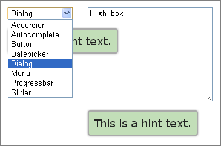

# Alter Position jQuery UI Tooltip

Alter Position jQuery UI Tooltip Plugin to alters position according to the situation.  
The default position is under the element. It looks best position. But, it is not sometimes.  
For example, it overlap pulldown list of `select`, or it is too lower position under the high `textarea`.



This plugin alters position by specified conditions. (e.g. height, tag-name)  
**See <a href="http://anseki.github.io/jquery-ui-tooltip-altposition/">DEMO</a>**

## Usage

- Load the `jquery.ui.tooltip.altposition.min.js` script file after loading `jquery.ui.tooltip.js` etc.
- The `altPosition` is added to Tooltip options. It accept the Object which can have following properties.

The position is altered to `altPosition.position` (alternative [option.position](http://api.jqueryui.com/tooltip/#option-position) Object of Tooltip) when any following conditions.

+ The tag-name of the element is `altPosition.tagName`.
+ `outerWidth` of the element is greater than or equal to `altPosition.minOuterWidth`
+ `outerWidth` of the element is less than or equal to `altPosition.maxOuterWidth`
+ `outerHeight` of the element is greater than or equal to `altPosition.minOuterHeight`
+ `outerHeight` of the element is less than or equal to `altPosition.maxOuterHeight`
+ `altPosition.callback` Function returns `true`

*NOTE:* These are joined by *OR*. (The position is altered if one or more conditions.)

## Example

```js
$('input,textarea,select').tooltip({
  altPosition: {
    minOuterHeight: 60,
    tagName: 'select',
    callback: function() { return this.element.val().length > 20; },
    position: {my: 'left+15 top', at: 'right top', collision: 'flipfit'} // Right side
  }
});
```
